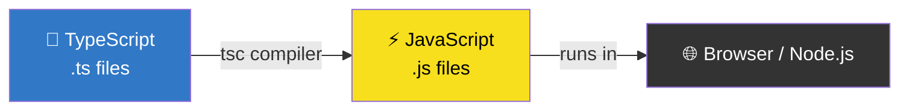

# 📘 TypeScript Mastery — Complete Guide

<div align="center">

```
╔══════════════════════════════════════════════════════════╗
║        🚀  WELCOME TO TYPESCRIPT MASTERY  🚀            ║
║     From Zero to Hero — A Bilingual Learning Path       ║
║           English • বাংলা • Code • Projects             ║
╚══════════════════════════════════════════════════════════╝
```

</div>

---

## 📑 Table of Contents

| Module | Topic | Key Concepts |
|:------:|:------|:-------------|
| [01](#-module-01--foundation--setup) | Foundation & Setup | Installation, Configuration, Architecture |
| [02](#-module-02--types--annotations) | Types & Annotations | Primitive, Non-Primitive, Special Types, Inference |
| [03](#-module-03--functions) | Functions | Parameters, Return Types, Arrow Functions, Project |

---

# 📘 Module 01 — Foundation & Setup

<div align="center">

```
┌─────────────────────────────────────────────┐
│  🏗️  Setting the Groundwork for TypeScript  │
└─────────────────────────────────────────────┘
```

</div>

---

## 🎯 What is TypeScript?

<table>
<tr>
<td width="50%">

### 🇬🇧 English

TypeScript is a **strongly typed** programming language that builds on JavaScript. Think of it as **JavaScript with superpowers** — it adds static type checking while keeping all JavaScript features intact.

> 🔑 **Key Insight:** TypeScript is a **syntactical superset** of JavaScript. Every `.js` file is a valid `.ts` file, but not vice versa.

</td>
<td width="50%">

### 🇧🇩 বাংলা

TypeScript হলো একটি **স্ট্রংলি টাইপড** প্রোগ্রামিং ল্যাঙ্গুয়েজ যা জাভাস্ক্রিপ্টের উপর ভিত্তি করে তৈরি। এটিকে **জাভাস্ক্রিপ্টের সুপারচার্জড ভার্সন** হিসেবে ভাবতে পারেন — স্ট্যাটিক টাইপ চেকিং যোগ করে, অথচ জাভাস্ক্রিপ্টের সকল বৈশিষ্ট্য অক্ষুণ্ণ রাখে।

> 🔑 **গুরুত্বপূর্ণ:** TypeScript জাভাস্ক্রিপ্টের **সিনট্যাক্টিক্যাল সুপারসেট**। প্রতিটি `.js` ফাইল `.ts` ফাইল হিসেবে বৈধ, কিন্তু উল্টোটা নয়।

</td>
</tr>
</table>

### 🔄 The Compilation Flow



---

## 🆚 TypeScript vs JavaScript — Visual Comparison

<table>
<tr>
<th width="33%">Feature</th>
<th width="33%">JavaScript 💛</th>
<th width="33%">TypeScript 💙</th>
</tr>
<tr>
<td>

### 🏷️ Type System
</td>
<td>

```
Runtime checking
Errors appear AFTER execution
```
```javascript
let age = "twenty";
age + 5; // "twenty5" 🤦
```
</td>
<td>

```
Compile-time checking
Errors appear WHILE coding
```
```typescript
let age: number = "twenty"; 
// ❌ Error immediately!
```
</td>
</tr>
<tr>
<td>

### 🔍 Error Detection
</td>
<td>🐛 Bugs found in production</td>
<td>🛡️ Bugs caught in editor</td>
</tr>
<tr>
<td>

### 💡 IDE Support
</td>
<td>Basic autocomplete</td>
<td>Rich IntelliSense + documentation</td>
</tr>
<tr>
<td>

### 📈 Scalability
</td>
<td>Challenging in large projects</td>
<td>Excellent for enterprise apps</td>
</tr>
</table>

---

## 🛠️ Installation & Setup

### 📋 Prerequisites Checklist

- [ ] Node.js installed (v14+)
- [ ] VS Code (or preferred editor)
- [ ] Terminal access
- [ ] Internet connection (for npm)

### 🚦 Step-by-Step Setup

<table>
<tr>
<td width="5%">

### 1️⃣
</td>
<td>

**Initialize Project**
```bash
npm init -y
```
> Creates `package.json` — your project's identity card
</td>
</tr>
<tr>
<td>

### 2️⃣
</td>
<td>

**Install TypeScript**
```bash
npm install typescript --save-dev
```
> Adds TypeScript compiler to your project only
</td>
</tr>
<tr>
<td>

### 3️⃣
</td>
<td>

**Generate Config**
```bash
tsc --init
```
> Creates `tsconfig.json` — the brain of your TypeScript setup
</td>
</tr>
<tr>
<td>

### 4️⃣
</td>
<td>

**Configure Paths** (in `tsconfig.json`)
```json
{
  "rootDir": "./src",    // Where YOU write code
  "outDir": "./dist"     // Where COMPILED code goes
}
```
</td>
</tr>
</table>

---

## ⚙️ Understanding `tsconfig.json`

```
┌────────────────────────────────────────────────────────┐
│                   tsconfig.json                        │
│                   ═════════════                        │
│  • Controls how TypeScript behaves                     │
│  • Defines input/output directories                    │
│  • Sets strictness levels                              │
│  • Determines which JS version to target               │
└────────────────────────────────────────────────────────┘
```

### 🎛️ Essential Settings

```json
{
  "compilerOptions": {
    "target": "ES2020",           // Output JS version
    "module": "commonjs",         // Module system
    "rootDir": "./src",           // Source folder
    "outDir": "./dist",           // Output folder
    "strict": true,               // Enable all checks
    "esModuleInterop": true       // Import compatibility
  }
}
```

---

## 📂 Project Architecture

```
TypeScript-Project/
│
├── 📁 src/                    ← You code here
│   └── index.ts               ← Entry point
│
├── 📁 dist/                   ← Auto-generated (DON'T EDIT)
│   └── index.js               ← Compiled output
│
├── 📁 node_modules/           ← Dependencies (DON'T TOUCH)
│
├── 📄 tsconfig.json           ← TypeScript settings
├── 📄 package.json            ← Project metadata
└── 📄 .gitignore              ← Files to exclude from Git
```

### 🚫 Git Ignore Rules

```gitignore
# MUST include these:
node_modules/
dist/
*.js.map
```

---

## 💻 First TypeScript Program

### 📝 Source Code (`src/index.ts`)

```typescript
// 🎯 A typed function that returns a person object
function createPerson(
  name: string, 
  age: number
): { name: string; age: number } {
  return { name, age };
}

// ✨ Creating a person
const user = createPerson("Emon", 40);

// 📤 Output
console.log("✅ Person created:", user);
```

### ▶️ Execution Methods

<table>
<tr>
<td width="50%">

#### Method A: Manual Compilation
```bash
# Step 1: Compile
tsc

# Step 2: Run
node dist/index.js
```
</td>
<td width="50%">

#### Method B: Direct Execution
```bash
# Install ts-node globally
npm install -g ts-node

# Run directly
ts-node src/index.ts
```
</td>
</tr>
</table>

---

# 📘 Module 02 — Types & Annotations

<div align="center">

```
┌──────────────────────────────────────────┐
│  🏷️  Understanding TypeScript's Core     │
│     Type System & Type Safety            │
└──────────────────────────────────────────┘
```

</div>

---

## 🗺️ TypeScript Type Hierarchy

```
                        ┌─────────┐
                        │  Types  │
                        └────┬────┘
                             │
           ┌─────────────────┼─────────────────┐
           │                 │                 │
     ┌─────▼─────┐    ┌─────▼─────┐    ┌─────▼─────┐
     │ Primitive │    │  Special  │    │  Complex  │
     └─────┬─────┘    └─────┬─────┘    └─────┬─────┘
           │                 │                 │
    ┌──────┼──────┐    ┌────┼────┐    ┌───────┼───────┐
    │      │      │    │    │    │    │       │       │
  string number boolean any unknown void  Array  Tuple  Object
```

---

## 📌 3.1 Primitive Types

<div align="center">

| Type | Represents | Example |
|:----:|:-----------|:--------|
| `string` | Text data | `"Hello"` |
| `number` | All numbers | `42`, `3.14` |
| `boolean` | True/False | `true`, `false` |

</div>

### 💻 Code Example with Annotations

```typescript
// ─── Primitive Types in Action ───

// 🟢 String: For textual data
const personName: string = "Emon Hossain Hira";

// 🟡 Number: For integers & floats (no separate int/float!)
const personAge: number = 23;

// 🔵 Boolean: For binary states
const isEnrolled: boolean = true;

// 📊 Output Section
console.log("╔══════════════════════╗");
console.log("║   PERSON PROFILE     ║");
console.log("╠══════════════════════╣");
console.log(`║ Name   : ${personName.padEnd(12)}║`);
console.log(`║ Age    : ${personAge.toString().padEnd(12)}║`);
console.log(`║ Student: ${isEnrolled.toString().padEnd(12)}║`);
console.log("╚══════════════════════╝");
```

---

## 📌 3.2 Non-Primitive Types

### 🔢 Arrays — Ordered Collections

```typescript
// ─── Array Type Annotations ───

// Method 1: Square bracket syntax (RECOMMENDED)
const scores: number[] = [95, 87, 92, 78];
const friends: string[] = ["Rahim", "Karim", "Jabbar"];

// Method 2: Generic syntax (same result)
const ages: Array<number> = [23, 25, 30];
const cities: Array<string> = ["Dhaka", "Chittagong"];

console.log("📊 Scores:", scores);
console.log("👥 Friends:", friends);
```

### 📦 Tuples — Fixed-Length Arrays

```
Tuple = [Known Length] + [Known Types] + [Fixed Order]

┌─────────┬─────────┬─────────┐
│ index 0 │ index 1 │ index 2 │
│ string  │ number  │ boolean │
└─────────┴─────────┴─────────┘
```

```typescript
// ─── Tuple: Structured Data ───

// [Name, Age, Enrollment Status]
const student: [string, number, boolean] = ["Emon", 23, true];

// Destructuring for clarity
const [sName, sAge, sStatus] = student;

console.log(`
┌──────────────────────┐
│  STUDENT TUPLE       │
├──────────────────────┤
│ Name  : ${sName.padEnd(12)}│
│ Age   : ${sAge.toString().padEnd(12)}│
│ Active: ${sStatus.toString().padEnd(12)}│
└──────────────────────┘
`);
```

---

## 📌 3.3 Special Types

### 🎭 Type Comparison Matrix

<table>
<tr>
<th>Type</th>
<th>Safety Level</th>
<th>Use Case</th>
<th>Best Practice</th>
</tr>
<tr>
<td>

### `any`
</td>
<td>🔴 Unsafe</td>
<td>Quick prototyping</td>
<td>❌ AVOID in production</td>
</tr>
<tr>
<td>

### `unknown`
</td>
<td>🟡 Safe (with checks)</td>
<td>API responses, user input</td>
<td>✅ Use with type guards</td>
</tr>
<tr>
<td>

### `void`
</td>
<td>🟢 Safe</td>
<td>Functions without return</td>
<td>✅ Explicit return type</td>
</tr>
<tr>
<td>

### `null` / `undefined`
</td>
<td>🟢 Safe</td>
<td>Absence of value</td>
<td>⚠️ Enable strict mode</td>
</tr>
</table>

### 💻 Complete Example

```typescript
// ─── Special Types Demo ───

// ⚠️ 'any' — Type safety OFF
let flexibleVar: any = "Hello World";
flexibleVar = 42;    // ✅ Allowed
flexibleVar = true;  // ✅ Allowed

// ✅ 'unknown' — Type safety ON
let safeVar: unknown = "Hello";

// Must CHECK type before using
if (typeof safeVar === "string") {
  console.log("📝 String value:", safeVar.toUpperCase());
} else {
  console.log("❓ Not a string:", safeVar);
}

// 📭 'void' — No return value
function logMessage(msg: string): void {
  console.log(`📢 ${msg}`);
  // No return statement needed
}

// 🈳 'null' and 'undefined'
const emptyValue: null = null;
const notAssigned: undefined = undefined;

logMessage("TypeScript is awesome!");
```

---

## 📌 3.4 Type Inference

```
┌──────────────────────────────────────────────┐
│  TypeScript is SMART enough to figure out    │
│  types automatically in many cases!          │
└──────────────────────────────────────────────┘
```

### 🤖 How Inference Works

```typescript
// ─── Type Inference Examples ───

// Case 1: Variable initialization
let inferredString = "Hello";     
//    ^? TypeScript knows this is 'string'
// inferredString = 42; ❌ Error!

// Case 2: Function return
function add(a: number, b: number) {  
  return a + b;  
  //    ^? TypeScript infers return type: number
}

// Case 3: Array initialization
let numbers = [1, 2, 3];  
//    ^? TypeScript infers: number[]

console.log("🧠 TypeScript inferred all types automatically!");
```

---

## 🚀 Module 02 Project: Student Profile System

```typescript
// ─── Type Alias for Student Profile ───
type StudentProfile = {
  name: string;
  age: number;
  isActive: boolean;
  courses: string[];
  marks: number[];
  meta: [string, number, boolean];  // [course, mark, passed]
};

// ─── Creating a Student ───
const emonProfile: StudentProfile = {
  name: "Emon Hossain Hira",
  age: 23,
  isActive: true,
  courses: ["CSE101", "EEE202", "BBA303"],
  marks: [90, 85, 78],
  meta: ["CSE101", 90, true],
};

// ─── Display Function ───
function displayProfile(profile: StudentProfile): void {
  console.log(`
╔══════════════════════════════╗
║     STUDENT PROFILE          ║
╠══════════════════════════════╣
║ Name   : ${profile.name.padEnd(20)}║
║ Age    : ${profile.age.toString().padEnd(20)}║
║ Status : ${profile.isActive ? 'Active' : 'Inactive'.padEnd(20)}║
║ Courses: ${profile.courses.join(', ').padEnd(20)}║
╚══════════════════════════════╝
  `);
}

displayProfile(emonProfile);
```

---

# 📘 Module 03 — Functions

<div align="center">

```
┌──────────────────────────────────────────┐
│  ⚡  Functions in TypeScript              │
│     Typed Parameters • Return Types      │
│     Arrow Functions • Calculator Project │
└──────────────────────────────────────────┘
```

</div>

---

## 📌 3.1 Function Type Annotations

### 🔬 Anatomy of a Typed Function

```
┌────────── Parameter Types ──────────┐
│                                     │
│  function name(param: type): returnType {  
│       ▲                        ▲
│       │                        │
│  Function name          Return type annotation
│                                     │
└─────────────────────────────────────┘
```

### 💻 Example

```typescript
// ─── Fully Typed Function ───
function greet(mood: string): string {
  return `😊 Yes, I am ${mood}!`;
}

const message: string = greet("excited");
console.log(message); // "😊 Yes, I am excited!"
```

---

## 📌 3.2 Parameter Variations

### 🎯 Parameter Types Visual Guide

| Parameter Type | Syntax | When to Use |
|:---------------|:-------|:------------|
| **Required** | `name: string` | Always needed |
| **Optional** | `name?: string` | Might be omitted |
| **Default** | `name: string = "Guest"` | Has fallback value |

### 💻 Complete Example

```typescript
// ─── Optional Parameters (marked with ?) ───
function planTrip(
  from: string,
  to: string,
  duration?: string  // 👈 Optional — can be undefined
): string {
  const time = duration || "unknown time";
  return `🚗 Trip: ${from} → ${to} (${time})`;
}

console.log(planTrip("Dhaka", "Sylhet"));          
// Output: 🚗 Trip: Dhaka → Sylhet (unknown time)

console.log(planTrip("Dhaka", "Sylhet", "5 hours"));
// Output: 🚗 Trip: Dhaka → Sylhet (5 hours)


// ─── Default Parameters (marked with =) ───
function createUser(
  name: string = "Guest User",  // 👈 Default value
  role: string = "Viewer"
): string {
  return `👤 ${name} — Role: ${role}`;
}

console.log(createUser());                         
// 👤 Guest User — Role: Viewer

console.log(createUser("Admin", "Administrator")); 
// 👤 Admin — Role: Administrator
```

---

## 📌 3.3 Return Types

### 🔁 Return Type Categories

```typescript
// ─── 1. Explicit Return Type ───
function multiply(x: number, y: number): number {
  return x * y;
}

// ─── 2. Void — Returns Nothing ───
function logInfo(info: string): void {
  console.log(`📋 ${info}`);
  // No return statement
}

// ─── 3. Never — Function NEVER finishes ───
function throwError(message: string): never {
  throw new Error(`💥 ${message}`);
  // Code after this is unreachable
}

// ─── Usage ───
console.log(`🔢 5 × 3 = ${multiply(5, 3)}`);
logInfo("Operation successful");
// throwError("Critical failure!"); // Uncomment to test
```

### 📊 Return Type Decision Flow

```
Does the function return a value?
         │
    ┌────┴────┐
    │         │
   YES        NO
    │         │
    │    ┌────▼────┐
    │    │  void   │
    │    └─────────┘
    │
    ▼
Can it ever finish?
    │
┌───┴───┐
│       │
YES     NO
│       │
│   ┌───▼────┐
│   │ never  │
│   └────────┘
▼
Return specific type
(string, number, etc.)
```

---

## 📌 3.4 Arrow Functions

### 🏹 Arrow Function Syntax

```
Traditional Function:
function add(a: number, b: number): number {
  return a + b;
}

Arrow Function Equivalent:
const add = (a: number, b: number): number => {
  return a + b;
};

Even Shorter (single expression):
const add = (a: number, b: number): number => a + b;
```

### 💻 Practical Example

```typescript
// ─── Arrow Function with Full Typing ───
const formatPerson = (
  name: string,
  age: number,
  isActive: boolean
): string => {
  return `👤 ${name} | Age: ${age} | Status: ${isActive ? '🟢' : '🔴'}`;
};

console.log(formatPerson("Emon", 23, true));
```

---

## 🚀 Module 03 Project: Typed Calculator

```typescript
// ═══════════════════════════════════════
//   🧮 TYPED CALCULATOR APPLICATION
// ═══════════════════════════════════════

// ─── Arithmetic Operations ───
const add = (a: number, b: number): number => a + b;
const subtract = (a: number, b: number): number => a - b;
const multiply = (a: number, b: number): number => a * b;
const divide = (a: number, b: number): number => a / b;

// ─── Calculator Function ───
function calculate(
  operation: string,
  num1: number,
  num2: number
): void {
  let result: number;
  
  switch (operation) {
    case '+': result = add(num1, num2); break;
    case '-': result = subtract(num1, num2); break;
    case '×': result = multiply(num1, num2); break;
    case '÷': result = divide(num1, num2); break;
    default:
      console.log('❌ Invalid operation');
      return;
  }
  
  console.log(`
┌──────────────────────────┐
│      CALCULATOR           │
├──────────────────────────┤
│  ${num1} ${operation} ${num2} = ${result}
├──────────────────────────┤
│  Operation: ${operation.padEnd(14)}│
│  Result:    ${result.toString().padEnd(14)}│
└──────────────────────────┘
  `);
}

// ─── Test Cases ───
calculate('+', 10, 20);   // 10 + 20 = 30
calculate('-', 50, 15);   // 50 - 15 = 35
calculate('×', 7, 8);     // 7 × 8 = 56
calculate('÷', 100, 5);   // 100 ÷ 5 = 20
```

---

## 📊 Progress Tracker

```
Module 01: Foundation      [██████████] 100%
Module 02: Types           [██████████] 100%
Module 03: Functions       [██████████] 100%
─────────────────────────────────────────
Overall Progress           [██████████] 100%
```

---

## 🎓 Key Takeaways

| Module | What You Learned |
|:-------|:-----------------|
| **01** | Setup TypeScript, configure `tsconfig.json`, compile to JS |
| **02** | Use primitive & complex types, understand inference |
| **03** | Write typed functions with optional/default params |

---

<div align="center">

```
╔══════════════════════════════════════════════════════╗
║     🎉 Congratulations! You've mastered the          ║
║        fundamentals of TypeScript! 🎉                ║
║                                                      ║
║     Keep practicing • Build projects • Stay typed    ║
╚══════════════════════════════════════════════════════╝
```

### ⚡ Happy Coding! / শুভ কোডিং! ⚡

</div>